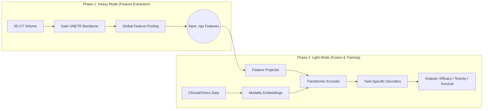

# Hepato-Multimodal-Transformer (HMT)

## 📖 Introduction (项目简介)

**Hepato-Multimodal-Transformer (HMT)** is a deep learning framework designed for the precision prognosis of Hepatocellular Carcinoma (HCC). It addresses the challenge of integrating high-dimensional 3D CT imaging with heterogeneous clinical/omics data under hardware-constrained environments.

This repository implements a **Decoupled "Heavy-Light" Training Strategy**, efficiently fusing **5 modalities** (CT Imaging, Clinical Data, Blood, Urine, Microbiome) to predict immunotherapy efficacy (RECIST), toxicity, and overall survival (Cox).

> **Note:** This is the **v1.0 Baseline Implementation**. For the next-generation architecture featuring Cross-Attention Avatar Engine, please refer to the `dev-v2-avatar` branch.

---

## 🚀 Key Features (核心特性)

*   **⚡ Decoupled Training Strategy (Heavy/Light Mode):**
    *   Separates high-computational 3D feature extraction (**Swin UNETR**) from multi-modal fusion logic.
    *   Enables training on large-scale multimodal cohorts using consumer-grade GPUs by freezing the vision backbone in the fusion stage.
*   **🧩 Transformer-based Fusion:**
    *   Utilizes a standard Transformer Encoder to capture intra- and inter-modality interactions.
    *   **Learnable Missing Tokens:** Robustly handles missing clinical data (e.g., missing urine/microbiome reports) without simple imputation.
*   **🎯 Multi-Task Learning Head:**
    *   Simultaneously predicts:
        1.  **Efficacy:** Binary classification (Responder vs. Non-responder).
        2.  **Toxicity:** Risk grading.
        3.  **Survival:** Time-to-event prediction using **Cox Proportional Hazards Loss**.
*   **🛠 Automated Engineering Pipeline:**
    *   Includes `run_full_experiment.sh` for end-to-end K-Fold cross-validation and result logging.

---

## 🏗 System Architecture (系统架构)

The framework operates in two distinct phases to optimize resource utilization:

📂 Directory Structure (目录结构)
code
Text
.
├── config.py                 # Centralized configuration (Paths, Hyperparams)
├── dataset.py                # Multi-modal Dataset loader & transforms
├── model.py                  # Transformer Architecture & Task Heads
├── modules.py                # Custom Layers & Loss Functions (Cox Loss, etc.)
├── train_heavy.py            # Phase 1: SwinUNETR training/extraction
├── train_light.py            # Phase 2: Lightweight Transformer fusion
├── extract_ct_features.py    # Utility script for offline feature extraction
├── run_full_experiment.sh    # Bash script for automated K-Fold experiments
└── README.md                 # Project documentation
🛠️ Usage (使用说明)
1. Environment Setup
code
Bash
# Recommended environment
conda create -n hmt_env python=3.8
pip install torch monai pandas scikit-learn lifelines
2. Data Preparation
Ensure your data follows the structure defined in dataset.py. The system expects:
CT Images: Preprocessed NIfTI/NPY files (96x96x96).
Tabular Data: A CSV file containing Clinical, Blood, Urine, and Microbiome features.
3. Run the Full Pipeline
To reproduce the K-Fold cross-validation experiment, simply run the controller script:
code
Bash
# Grants execution permission
chmod +x run_full_experiment.sh

# Run the full pipeline (Heavy extraction -> Light fusion)
./run_full_experiment.sh
Alternatively, you can run individual phases:
code
Bash
# Phase 1: Train/Fine-tune Vision Backbone (Optional)
python train_heavy.py --mode train

# Phase 2: Extract Features
python extract_ct_features.py --output_dir ./data/features

# Phase 3: Train Fusion Model
python train_light.py --fold 0
📊 Methodological Details (技术细节)
The "Heavy-Light" Design
Training a 3D Swin Transformer end-to-end with 4 other modalities requires massive GPU memory (>48GB).
Heavy Mode: We freeze tabular inputs and focus on optimizing the 3D CNN/Transformer backbone (Swin UNETR) to extract robust spatial features.
Light Mode: We freeze the 3D backbone and project the extracted visual features into a shared semantic space with omics data. The computational cost is reduced by ~90%, allowing for rapid hyperparameter tuning and architecture search.
Missing Modality Handling
Instead of zero-filling, we introduce learnable "Missing Tokens". If a patient lacks microbiome data, the specific token is replaced by a learnable vector, allowing the network to distinguish between "value 0" and "data missing".
📝 Future Work (Roadmap)

v1.0: Decoupled training pipeline with standard Transformer Fusion.

v2.0: "Avatar" Architecture: Replacing simple concatenation with a Dual-Stream Cross-Attention Engine to enable semantic querying between Omics and Imaging. (See dev branch).

Verification: Large-scale external validation on multi-center cohorts.
📧 Contact
Donghai Lu
Role: Project Lead & Algorithm Engineer
Affiliation: Shandong University / Qilu Hospital
Research Interest: AI for Medical Imaging, Multimodal Fusion, Surgical Data Science